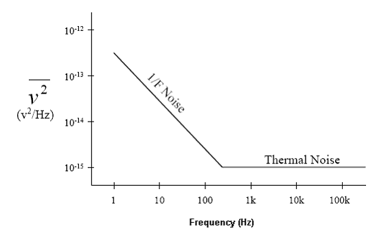
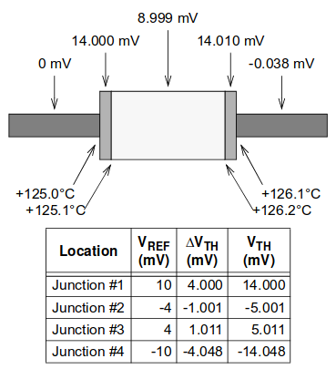
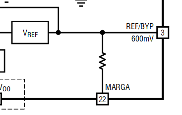
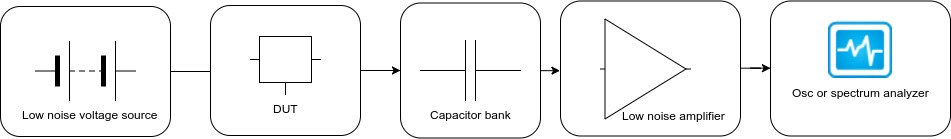
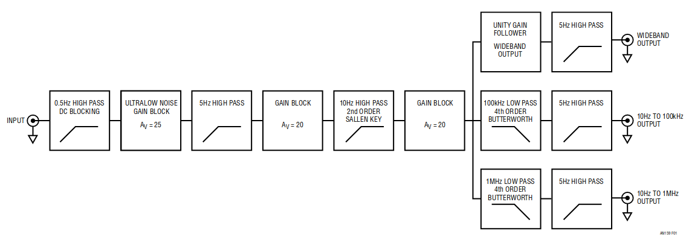
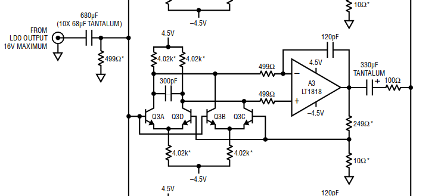
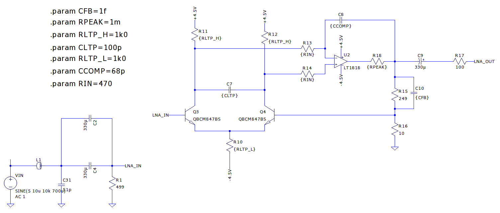
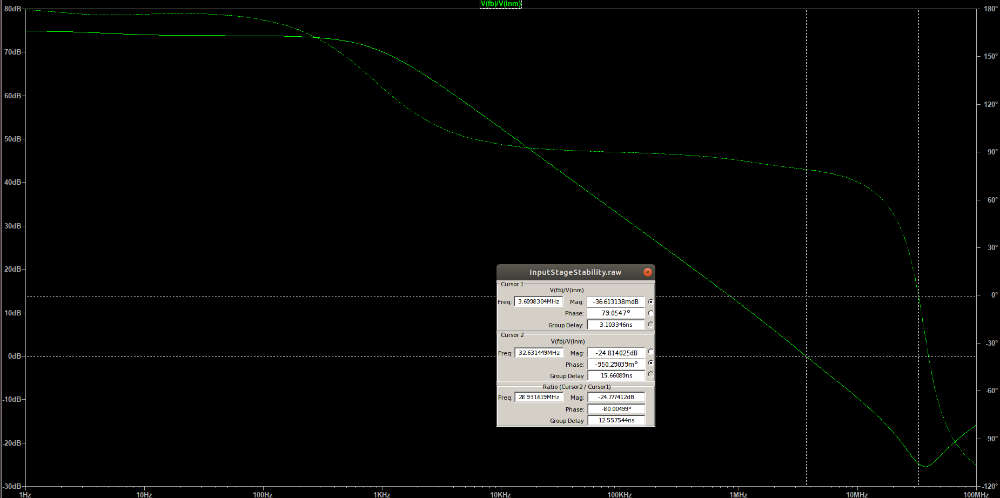
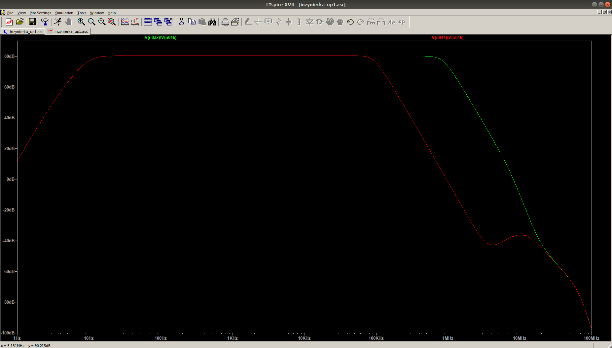

# Measuring Noise in Voltage Regulators

#### Paweł Woźny   Faculty  of Electronics and Telecommunication, AGH 
---

#### Introduction
Following presentation will cover state of the art in current methods of measuring noise generated by regulators. 
In addition, current progress of my work will be shown.

Agenda:

1. What is voltage regulator?
2. What noise regulators have?
3. How to combat them?
4. My progress.

#### Voltage regulator
> is a device which converts unregulated supply to more or less stable output.

Simple regulator with opamp:

##### Theory of operation

- Voltage reference.
- Feedback network.
- Error amplifier.
- Output stage.
 
#### Sources of noise in circuit

- Intrinsic semiconductor's noises:
    - popcorn noise,
    - shot noise,
    - 1/f (pink)noise.
    - Thermal noise (Johnson, wide-band, white) 
    
- Effect of temperature dependency.
- Seebeck (Thermoelectric effect).

  

- Electromagnetic coupling
- Piezoelectric effects

### Mitigation of noise
- Improving process of lithography.
- Using dynamic offset cancelation (chopper amplifier).
- Using smaller value of resistance:
    - 600 Ohm resistor, 1kHz BW: 0.098uV RMS
    - 50 Ohm resistor, 1kHz BW: 0.0089uV RMS
- Derating elements.
- Filtering the reference:

  

### State of the art
Simplified block diagram:

Fully fledged block diagram:

 

First stage of amplifier:

 

My adaptation:

 

Stability of amplifier:

transfer Function:

### ToDo:
- Order components
- create and validate layout
- perform meauserments