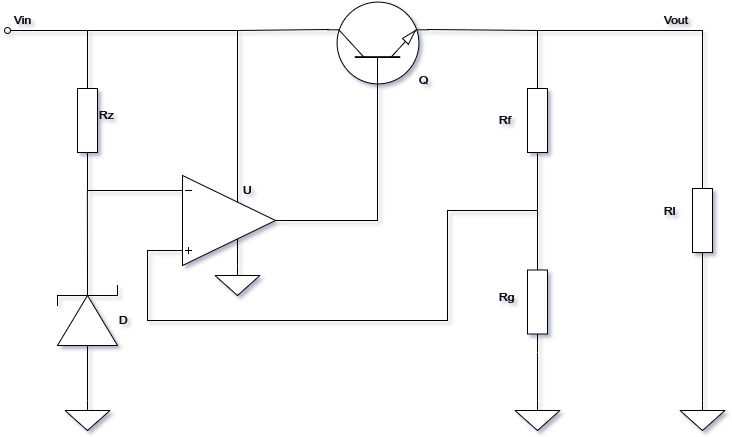

# Measuring Noise in Voltage Regulators

#### 
 Paweł Woźny   Faculty  of Electronics and Telecommuniacation, AGH 

---

#### Introduction
Following presentation will cover state of the art in current methods of measuring noise generated by regulators. 
In addition, current progress of my work will be shown.

Agenda:

1. What is voltage regulator?
2. What noise regulators have?
3. How to combat them?
4. My progress.

&nbsp;

#### Voltage regulator
> is a device which converts unregulated supply to more or less stable output.

Simple regulator with opamp:

##### Theory of operation

- Voltage reference.
- Feedback network.
- Error amplifier.
- Output stage.
 
#### Sources of noise in regulator

- Intrinsic semiconductor's noises:
    - popcorn noise,
    - shot noise,
    - 1/f (pink)noise.
    - Thermal noise (Johnson, wideband, white) 
    
- Effect of temperature dependency
- Seebeck (Thermoelectric effect)

### Mitigation of noise

 

 asdasda

---
<b> dasd asdasd</b> 