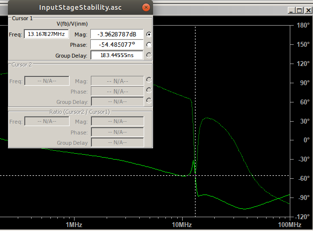
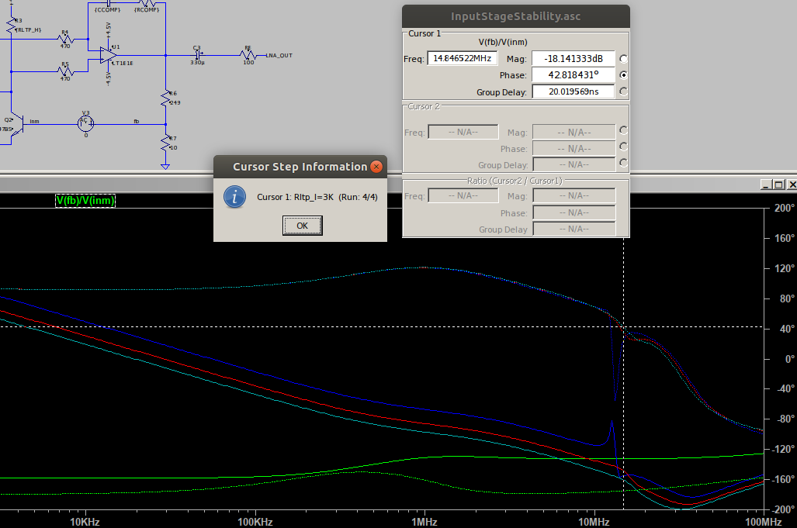
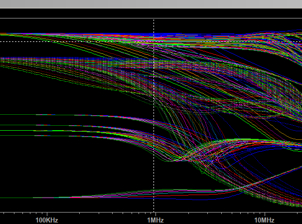
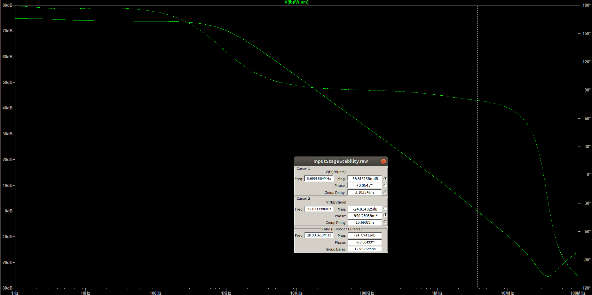
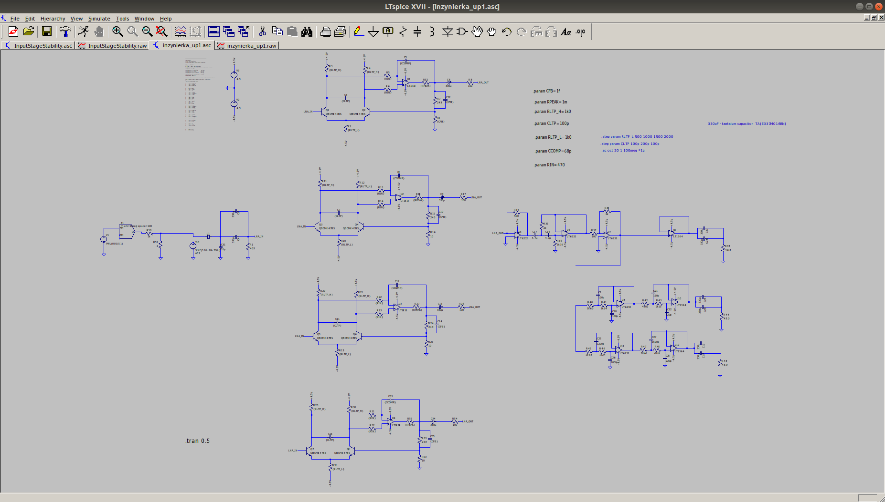

#### Nonconstraint text which allow me to convey my thoughts
---
First try: to create discrete analog input stage

https://www.byteparadigm.com/files/documents/Using-SPI-Protocol-at-100MHz.pdf

https://www.ebay.com/itm/DC-DC-Boost-Step-Up-Isolated-Volt-Converter-5V-to-12V-125mA-Power-Supply-Module/323418069670?hash=item4b4d381aa6:g:lkwAAOSw64tbhhjZ

http://www.analog.com/media/en/technical-documentation/application-notes/an83f.pdf,

http://www.ti.com/lit/an/snoa387c/snoa387c.pdf

https://www.allaboutcircuits.com/technical-articles/understanding-noise-and-psrr-in-ldos/

http://www.ti.com/lit/ds/symlink/opa1611.pdf

http://www.ti.com/lit/an/slyt133/slyt133.pdf

very useful:
http://www.ti.com/lit/wp/slyy076/slyy076.pdf

po prostu sie nie da uzyc zewnetrznego adc:

- szybki ADC (>40Mbit/s) wymaga szybkiego interfejsu. Niezawodność dostarczania próbek może zapewnić tylko STM
- parę wolnych adceków można zrównoleglić i sterować za pomocą rpi0. tylko tam opóźnienie linuxa jest kurwą i nie otrzyma się powtarzalnych wyników.
- adcek zintegrowany w stm32 będzie szumił, a do tego będzie problem z izolacją toru pomiarowego

Moja propozycja:

- Rpi0 łączy się z FTDI HS, który łączy się przez izolator z ADC przez SPI, który jest sterowany z AFE. FTDI wyprowadza gpio potrzebne do sterowania afe

lub:

- afe - adc - iso - stm32/w usb, ram, sd

pierdułki dla kicada
https://knowledge.autodesk.com/support/autocad-electrical/learn-explore/caas/CloudHelp/cloudhelp/2019/ENU/AutoCAD-Electrical/files/GUID-7871E6EF-24D5-467E-9B74-321FEDC9DFDA-htm.html

---
tutaj należałoby skomasować swoje przemyślenia:
xxxxx
---
4.10.2018

Pod tym linkiem znajduje się ulepszona wersja układu od jima:
http://www.analog.com/media/en/technical-documentation/application-notes/an159fa.pdf

- Mają drogie tranzystory na stopniu wejściowym: THAT300A. kosztuje około 45plz/sztukę, a potrzeba przynajmniej 4.
Łączą dwie pary różnicowe równolegle. W pdfie pd czecha {{}}} było pokazane, że to może wpłynąć negatywnie na {{{{{}}}}}
- Sama para różnicowa jest mocno dopasowane. Ciekawe czy dałoby się użyć tańszych elementów przy zastosowaniu aktywnej kompensacji, jak tutaj:
http://www.analog.com/media/en/technical-documentation/application-notes/an124f.pdf
Na przykład 
- Używają kondensatory tantalowe, które nie mają efektu piezo. Tylko trzeba uważać, żeby nie wybuchły

Porównując dshety:
https://assets.nexperia.com/documents/data-sheet/BCM847BV_BS_DS.pdf
oraz
http://www.thatcorp.com/datashts/THAT_300-Series_Datasheet.pdf
wychodzi na to, że aż tak bardzo się nie różnią. THAT300 ma dopasowanie hfe na poziomie 4% vs 10% od BCM847BV, natomiast dopasowanie VBE THAT300 ma 3mV max z 0.5 typowym, a BCM847 ma** 2mV MAX**.

---
6.10.2018

Stworzyłem cały schemat dla wzmacniacza. Od razu wiedzę --2-- trzy problemy

- Obudowa. Jeżeli będzie zrobiona ze stali (a stal jest najtańsza) to ścianka musi być gruba na 10-15mm
https://allegro.pl/blacha-stalowa-10-mm-cieta-na-wymiar-i6728885673.html
- stabilność wzmacniacza. Jest dużo stopni wzmacniacza i każdy może oscylować. ;/
- małe napięcie wyjsciowe. Napięcie wyjściowe dla wejścia 1uV wynosi 10mV. przydałyby się kolejne stopnie wzmocniania dla obróbki z ADCkiem

Zasilanie bateryjne mogą zapewnić baterie R20.
https://allegro.pl/koszyk-na-baterie-3xr20-plaski-i7416083768.html 

Tranzystory uzyte przeze mnie mają inne pojemności od THATowych. PRzez co musiałem pozmieniać układ

Czy dwa kondensatory tantalowe 330uF będą miały takie same (albo przynajmniej wystarczające) właściwośći przy granicy 1MHz?
TAJE337M016RNJ

Zamiast 2 330stek można użyć trzy 220uF

Albo 100u faradowe:  T491D107K020AT (dostępne w TME)

Koszt samych  kondensatorów to około 100pln

---
7.10.2018

Skoczyłem układ. No nie do końca bo jest niestabilny. Przy dodaniu czwartego stopnia wejściowego dostaje oscylacji koło 13MHz. Zrobiłem projekt ze samym stopniem wejściowym i zaczynam poszukiwania
Wygląda na to, że gdy podłączam wejście od 4. układu to całość dostaje pierdolca.

Problem okazał się dolny rezystor. Zmiana z 1k do 3k pomogła.
 

Udało się! Nie oscyluje i ma xxx marginesu

Podczas Różnorakich testów można było zauważyć, że łatwo nasycić wzmacniacz. Może dodać możliwość zmiany wzmocnienia ostatniego bloku?
 
 - 100Ohm/2k
 - 100Ohm/100Ohm
 
 Symulacja tran dla przemiatanej czestotliwości wykazała, że wzmocnienie spada ?liniowo? ze wzrostem czestotliowści. Dla f=650kHz wzmocnienie było równe tylko 0.560 wartości początkowej.
 
 Przez tą kompensacje przysiadło trochę wzmocnienie
 
 bawiąc się .tep zauważyłem, że można symulować do trzeb zmiennych jednocześnie. Fajnie by było jakbym znalazł możliwość automatycznego wybierania pożądanych charakterystyk; np w moim przypadku interesują mnie tylko te wartośći, dla których wzmocnienie przyy 1MHz jest równe 28dB
 
 
 Ostateczny wynik stabilności:
 
 Schemat układu:
 
 
 Lista zakupów:
 
 - precyzyjne rezystory 1k:  MORNTA1001AT5 - 4 sztuki
 - rezystory do FB 250Ohm/10Ohm: Coś z elpoda 0.25%/10ppm 4 sztuki
 asd
 
 
 
 
 
 
 
 
 
 
 
 
 
 
 
 
 
 
 
 
 
 
 as
 
 